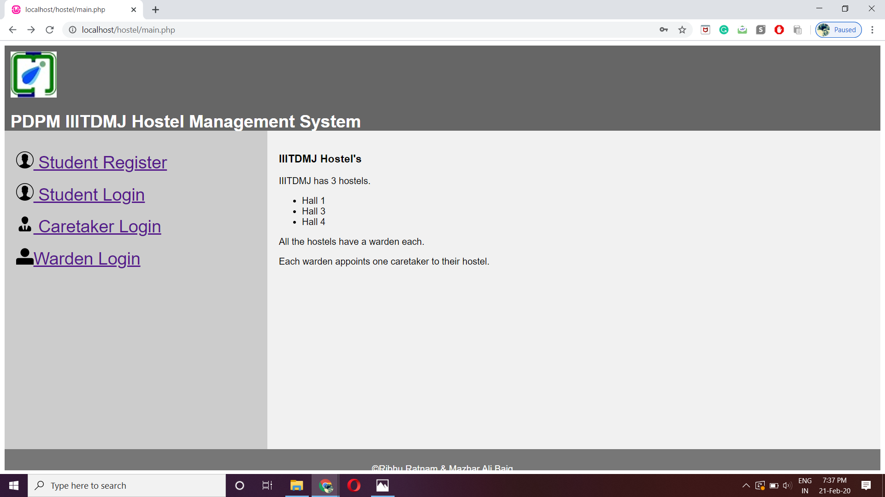

# RASH
Room Allotment System for Hostels - web portal for allotting and changing rooms with seperate interfaces for wardens, caretakers and students.

## INSTALLATION :


* LINUX 

  * Install LAMP Server
  * Clone the repository: `git clone https://github.com/mazharalibaig/RASH.git`
  * Copy RASH folder to `/var/www/html/`
  * Open Browser and navigate to `http://localhost/RASH/`

* MAC 

  * Install MAMP Server
  * Navigate to Applications/MAMP/htdocs/
  * Clone the repository: `git clone https://github.com/mazharalibaig/RASH.git`
  * Start MAMP Server
  * Open Browser and navigate to `http://localhost/RASH/`

* WINDOWS

  * Install WAMP Server
  * Navigate to the directory `/wamp/www`
  * Clone the repository: `git clone https://github.com/mazharalibaig/RASH.git`
  * Start the WAMP Server
  * Open Browser and navigate to `http://localhost/RASH/`
  
## SCREENSHOTS :


```diff
+ PORTAL'S HOME PAGE :

```




```diff
+ SIGN-UP PAGE :

```


```diff
+ LOGIN PAGE :

```


```diff
+ USER'S HOME PAGE :

```


```diff
+ CHANGE PASSWORD :

```

```
+ ROOM BOOKING :
```


```
+ Change Room :
```


